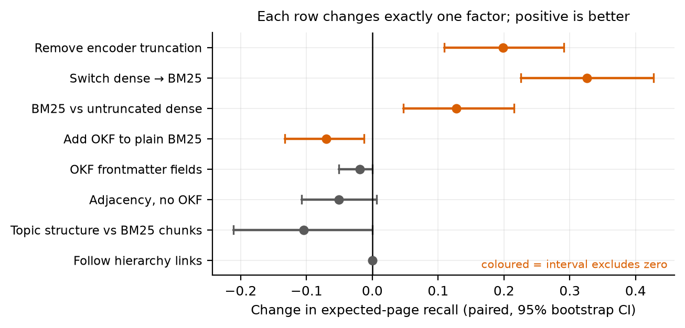
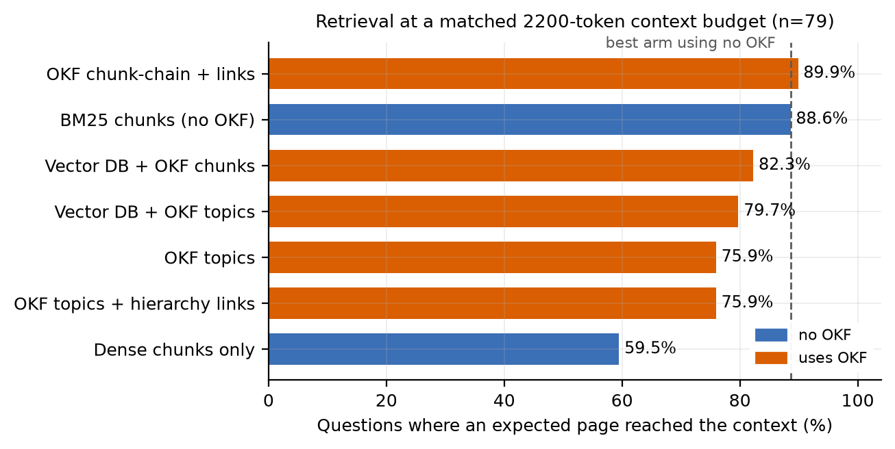
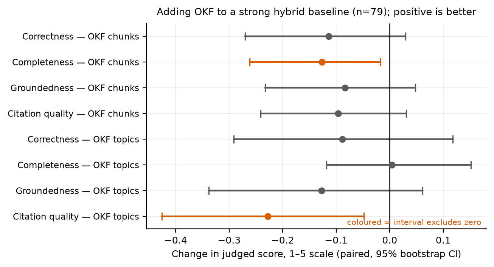

# Weak Baselines Manufacture Format Advantages: A Controlled Study of Google's Open Knowledge Format for Retrieval-Augmented Generation

**Kumar Abhinav**  
AiDash · abhinav@aidash.com  
ORCID [0009-0009-1839-841X](https://orcid.org/0009-0009-1839-841X)  
Code and data: https://github.com/Abhinav0905/okf-vs-rag-evaluation  
Archived: [doi:10.5281/zenodo.21778673](https://doi.org/10.5281/zenodo.21778673)

## Abstract

Google Cloud's Open Knowledge Format (OKF) represents knowledge as Markdown documents with YAML metadata and links between them [1, 2]. Its specification lists storage, query infrastructure and ranking as explicit non-goals, yet the format is widely described in public commentary as a replacement for vector databases and for retrieval-augmented generation. We test that claim on a 623-page public regulatory filing using 93 questions with page-level answer keys. Our first measurement appeared to confirm it decisively: a lexical OKF consumer reached 91.1% page-hit against 65.8% for a vector-database baseline. It was an artifact. The baseline encoder truncates at 256 tokens while 80.9% of passages are longer, so it encoded a median of 64.4% of each passage; plain BM25 over the same text, using no OKF at all, reached 97.5%. Measured against that baseline, adding OKF costs page recall (-0.070 [-0.133, -0.013]). We then built OKF as its documentation intends, with 1,011 concepts, one per topic, nested 6 levels with parent, child and sibling links, derived from the document's own outline and retaining 99.9% of its words verbatim; it scored below flat chunk retrieval (-0.104 [-0.211, +0.000]). Two measured mechanisms explain this: link traversal contributed 104 of 588 context units but 0 answer pages the direct matches had not already found, and 12 topics exceed the whole context budget, making their text unreachable. Finally, in an end-to-end A/B (279 answers, 837 blinded gradings), adding OKF to a weak vector-only pipeline improved page recall by +0.226 [+0.133, +0.323], while adding it to a strong BM25-plus-dense-plus-reranking pipeline improved nothing: seven of eight paired answer-quality estimates were negative. The same intervention therefore reads as a decisive win or as nothing at all, depending only on the baseline beside it. We release the benchmark, both bundles, all raw outputs and the harness.

**Keywords:** retrieval-augmented generation; information retrieval; Open Knowledge Format; weak baselines; lexical retrieval; knowledge representation; reproducibility; negative results

## 1. Introduction

Retrieval-augmented generation couples a generator with a non-parametric evidence store, which makes retrieval quality a primary determinant of factual coverage and traceability [3, 4]. How that evidence store is *written down* has received far less attention than how it is searched. Most systems hold long documents as isolated chunks, with relationships, provenance and lifecycle carried in whatever metadata the implementation happens to adopt.

Google Cloud's Open Knowledge Format proposes a portable alternative: UTF-8 Markdown concept documents with YAML frontmatter, ordinary Markdown links, directory indexes, and explicit provenance and lifecycle fields [1, 2]. The specification deliberately leaves storage, query infrastructure and ranking unspecified. It is a representation, not a retrieval method.

That distinction has largely been lost in public discussion, where the format is routinely presented as superseding vector databases and RAG. The claim is testable, and worth testing, because a knowledge representation that genuinely improved retrieval would change how these systems are built.

This paper reports what happened when we tested it — including the fact that our own first result supported the popular claim and was wrong. That sequence is the paper's central contribution. The information retrieval community has documented the weak-baseline problem for two decades: reported gains often fail to accumulate, and many neural results shrink or disappear against properly configured lexical baselines [7, 8, 9]. What we add is a contemporary instance arising from a *representation* comparison, where the confound is easier to miss because the artifact under test is not a ranker at all.

**Contributions.**

- A controlled evaluation of two disclosed OKF producers and consumers on a large regulatory document, with a fixed question set and page-level answer keys.
- A decomposition attributing an apparently decisive format advantage to encoder truncation and to the lexical-versus-dense contrast, leaving no measurable contribution from OKF itself.
- A topic-structured bundle built from the document's own heading hierarchy with fully verbatim text, testing the format as its documentation intends rather than a minimal reading of it, with two measured mechanisms for why it underperforms flat chunks.
- An end-to-end A/B showing that an identical OKF addition reads as a large improvement or as none, depending only on the strength of the baseline beside it.
- A released artifact: benchmark with answer keys, both bundles, all generated answers and gradings, a protocol with a complete deviations log, and a manuscript regenerated from the records.

## 2. Background and Related Work

**Retrieval-augmented generation.** Lewis et al. combined parametric generation with retrieved non-parametric memory [3]; Dense Passage Retrieval established the bi-encoder as a practical first stage [4]; cross-encoder reranking trades computation for richer query-document interaction [11]. Later work adds iteration and self-assessment, with Self-RAG training reflection behaviour [15] and FLARE triggering retrieval from predictions of forthcoming content [16]. We propose no new generator and no new ranker; we vary how the corpus is represented and which component reads it, holding everything else fixed.

**Lexical and dense retrieval, and the weak-baseline problem.** BM25 remains a strong and inexpensive ranking function [5]. BEIR showed that dense retrievers frequently fail to beat it out of domain [6], and MTEB documents wide variation among embedding models [13], including the short input windows typical of small sentence encoders [12]. The methodological hazard is long established: Armstrong et al. showed that two decades of reported ad-hoc retrieval gains largely failed to accumulate because many were measured against weak baselines [7], and Lin and Yang et al. made the same case for neural ranking [8, 9]. Our contribution is not to restate this but to show it arising in representation research, where the comparison to a retrieval baseline can look incidental rather than central. Reciprocal rank fusion provides a standard scale-free way to combine lexical and dense evidence [10]; we use it for both our strong baseline and our fusion arms.

**Structure-aware retrieval.** GraphRAG derives entity graphs and community summaries and helps particular classes of global question [14]. The distance between that and what we test matters: our producers emit document-structural links — previous, next, parent, child, sibling — not entity relations or learned semantic edges, and perform no summarisation. A null for structural links says nothing about semantic graphs.

**Evaluating RAG.** KILT evaluates task output jointly with provenance [17] and QASPER provides document-grounded questions with evidence annotations [18]; both motivate our page-level answer keys. RAGAS separates retrieval and generation dimensions [19]. Model-based judging scales evaluation but carries position, verbosity and self-preference biases [20], so we grade against independent reference answers and source pages rather than against each system's own retrieved context, blind the arm labels, and repeat each grading three times. Retrieval evaluation is sensitive to sample size and multiplicity [21], so paired tests, bootstrap intervals and Holm correction [22] are used throughout, and non-significance is not read as equivalence [23].

**The Open Knowledge Format.** The v0.2 specification defines concept documents, hierarchy, links, provenance, verification and lifecycle, and states that storage, serving and query infrastructure are non-goals [1]. The launch material positions OKF as a portable, version-control-reviewable knowledge source feeding existing retrieval stacks rather than replacing them [2]. A targeted search at the time of writing located the specification, official announcements, community implementations and a large volume of informal commentary, but no controlled retrieval benchmark. We therefore believe this to be the first such measurement, while noting that this is a search observation rather than a priority claim.

## 3. Study Design

**Document and questions.** The corpus is Pacific Gas and Electric's 2026-2028 Base Wildfire Mitigation Plan, a 623-page filing in a public regulatory proceeding (SHA-256 e601db57...dfb5dc6a). The question set, `wmp_okf_pge_93_v2`, contains 93 items: 79 answerable, each with a reference answer and the pages its evidence occupies, and 14 controls whose answers are absent from the document, for which the correct behaviour is to decline. Answer keys were corrected against the source before any reported run; corrections, exclusions and hashes are in the released audit. Blinded human validation has not been performed and is listed among the limitations.

**Producer A, chunk-preserving.** Each of the 1,837 existing retrieval chunks becomes one concept with text unchanged, linked only to its predecessor and successor. The release verifies that all 1,837 passages are byte-identical to the rows in the vector database, which is what permits both arms to be scored against one answer key.

**Producer B, topic-structured.** This tests the format as its documentation describes it. The PDF carries an embedded outline of 1,006 entries, which is the author's own topic hierarchy. Each concept is one outline entry: the title is the heading verbatim, the body is the text between that heading and the next, delimited by the exact page and y-coordinate destination recorded for the entry, and the links are parent, child, previous and next sibling, plus the cross-references the document itself makes. Nothing is summarised, rewritten or generated. The result is 1,011 concepts at 6 levels retaining 99.9% of the document's words, covering all 77 annotated answer pages, with a verified content digest. Front matter is included as its own topic because six questions have answer keys there.

**Common-unit evaluation.** Topic concepts and chunks differ in size, so a matched top-k would favour whichever arm has larger units, since more text trivially covers more pages. Every arm instead fills the same 2200-token context budget and is scored on what lands inside it. Units are never truncated, because a truncated passage would otherwise earn page credit for text that was never supplied.

**Answer scoring.** Answers come from one fixed pipeline and generator at temperature zero, graded by a separate model that never sees the arm label. Grading is against an independent reference answer and source passages drawn only from the annotated pages, not against the context a system selected for itself, which would let a system that retrieved nothing still appear correct. The judge returns a typed object through forced tool use, validated by a strict independent parser; malformed responses are retried under a cap and then recorded as missing, never replaced with a neutral score. Each answer is graded three times. For controls, correctness is undefined and refusal accuracy is scored instead; an inappropriate refusal on an answerable question receives a predeclared floor rather than being dropped.

**Statistics.** Effects are paired by question. Intervals are 10,000-sample question-cluster bootstraps; binary page-hit changes use exact McNemar tests; families of comparisons carry Holm correction [22]. Arms added after results had been seen are labelled exploratory, carry their own separate family, and are reported as estimation rather than hypothesis testing.

## 4. Results

### 4.1 The apparent advantage decomposes into baseline defects

The headline contrast changes three things at once: the ranking function, how much of each passage the encoder can read, and OKF itself. Varying one at a time isolates each.

| Retrieval arm | OKF? | Page hit | Recall | nDCG@10 | ms |
|---|---|---|---|---|---|
| Dense, 256-token limit | no | 65.8% | 0.599 | 0.513 | - |
| Dense, 8192-token limit | no | 86.1% | 0.797 | 0.614 | 341.6 |
| BM25 over raw chunks | no | 97.5% | 0.925 | 0.765 | 1.6 |
| BM25 + dense, fused | no | 96.2% | 0.899 | 0.728 | 323.6 |
| Dense seeds + OKF links | yes | 63.3% | 0.586 | 0.509 | - |
| BM25 over concepts + OKF links | yes | 91.1% | 0.855 | 0.747 | - |
| As above, frontmatter removed | yes | 92.4% | 0.874 | 0.653 | 1.8 |
| BM25 + adjacency, no OKF | no | 92.4% | 0.874 | 0.746 | 1.5 |

*Table 1. Retrieval over 79 page-annotated questions at top-10. The strongest arm contains no OKF component.*

**The baseline encoder could not read the passages.** `all-MiniLM-L6-v2` accepts 256 word-piece tokens. Over this corpus 80.9% of the 654 passages exceed that limit (median 398, maximum 2,035), and the encoder received a median of 64.4% of each passage while a lexical index reads all of it. Replacing only the encoder, holding the method fixed, moved page recall by +0.198 [+0.110, +0.291] (Holm p = 0.001).

**The remainder is the lexical-dense contrast, not OKF.** Plain BM25 over the unmodified chunks, with no concept files, no frontmatter and no links, moved page recall by +0.326 [+0.226, +0.427] (Holm p = < 0.001) against the frozen baseline, and by +0.128 [+0.047, +0.215] against the untruncated encoder. Measured against plain BM25, adding OKF changed page recall by -0.070 [-0.133, -0.013], a loss whose interval excludes zero. The frontmatter fields contribute -0.019 [-0.051, +0.000], indistinguishable from nothing.

The loss has a testable mechanism. The consumer reserves half its result budget for adjacent passages, and those positions would otherwise hold better-matching text. Driving the identical expansion from chunk ordinals rather than OKF links reproduces the same loss (-0.051 [-0.108, +0.006]), so the cause is budget allocation, not the format.

*Figure 1. Paired effect of changing one factor at a time on expected-page recall; positive is better. The two largest effects are baseline defects, and every OKF component is null or negative.*

### 4.2 Topic structure underperforms flat chunks

| Retrieval arm | Page hit | Recall | Units | Duplicated |
|---|---|---|---|---|
| Dense chunks only | 59.5% | 0.549 | 6.8 | 3.9% |
| BM25 chunks, no OKF | 88.6% | 0.814 | 5.3 | 1.4% |
| OKF chunk-chain + links | 89.9% | 0.827 | 5.8 | 2.0% |
| OKF topic-structured | 75.9% | 0.710 | 6.7 | 3.6% |
| OKF topics + hierarchy links | 75.9% | 0.710 | 7.4 | 4.2% |
| Vector DB + OKF topics | 79.7% | 0.752 | 6.8 | 7.6% |
| Vector DB + OKF chunks | 82.3% | 0.774 | 7.0 | 12.9% |

*Table 2. Retrieval at a matched 2200-token context budget over 79 questions. 'Duplicated' is budget spent on pages an earlier unit already covered.*

The topic-structured bundle scores below plain chunk retrieval (-0.104 [-0.211, +0.000]). Two mechanisms are measured, not inferred.

- **The links carried no new evidence.** Traversal did function: 104 of 588 packed units arrived by following parent, child or sibling links. They supplied 0 answer pages that the direct lexical matches had not already found, and enabling traversal changed recall by +0.000 [+0.000, +0.000].
- **Coarse topics can become unreachable.** 12 topics exceed the whole 2200-token budget, so their text is present in the bundle but can never be retrieved as a unit. The largest is the document's own table of contents at 27,768 tokens, and that single consequence loses the four questions asking on which page a section begins, evidence flat chunking retrieves without difficulty.

Fusing a vector store with an OKF bundle also duplicates text, because the bundle holds a verbatim copy of the same document: 12.9% and 7.6% of the context budget goes on already-covered pages in the two fused arms.

*Figure 2. Retrieval at a matched context budget. The dashed line marks the best arm containing no OKF component.*

### 4.3 The A/B result depends on the baseline, not on OKF

Arm A is a conventional strong pipeline: BM25 and dense retrieval over chunks, fused by reciprocal rank [10], then cross-encoder reranked [11]. Arm B is arm A *plus* one additional source, a lexical retriever over an OKF bundle, fused and reranked identically. Because B differs from A only in the presence of OKF, the contrast estimates what OKF adds to a baseline that is already good. Pipeline code, prompts, context budget, generator, temperature and judge are unchanged across arms. 279 answers and 837 gradings completed with no failures.

| Arm | Correct. | Complete. | Ground. | Citation | Refusal | Page hit |
|---|---|---|---|---|---|---|
| A: hybrid RAG | 4.620 | 4.608 | 4.776 | 4.680 | 1.000 | 86.1% |
| B: + OKF topics | 4.532 | 4.612 | 4.654 | 4.429 | 1.000 | 84.8% |
| B: + OKF chunks | 4.506 | 4.481 | 4.693 | 4.583 | 1.000 | 82.3% |

*Table 3. End-to-end outcomes. Judged dimensions are 1-5 over 79 answerable questions; refusal accuracy is over the 14 controls.*

| Change | Correctness | Completeness | Groundedness | Citation quality |
|---|---|---|---|---|
| + OKF chunks | -0.114 [-0.270, +0.030] | -0.127 [-0.262, -0.017] | -0.083 [-0.232, +0.048] | -0.096 [-0.241, +0.031] |
| + OKF topics | -0.089 [-0.291, +0.118] | +0.004 [-0.118, +0.152] | -0.127 [-0.338, +0.062] | -0.228 [-0.425, -0.048] |

*Table 4. Paired differences against arm A with 95% bootstrap intervals. Intervals are uncorrected across the eight dimension comparisons.*

Correctness is null in both directions (-0.089 [-0.291, +0.118] for topics, -0.114 [-0.270, +0.030] for chunks). Two dimensions are measurably worse: citation quality with topics (-0.228 [-0.425, -0.048]) and completeness with chunks (-0.127 [-0.262, -0.017]). Per question, topics won 3 and lost 7; chunks won 2 and lost 10. All three arms declined all 14 controls correctly, so OKF neither helped nor harmed abstention.

The robust observation is not any single interval. Seven of the eight dimension estimates are negative across two independently constructed OKF variants, and this agrees with retrieval, measured separately. Because eight comparisons were made without correction across dimensions, any one interval should be read as suggestive; the consistent sign is the finding.

*Figure 3. Paired answer-quality effects of adding OKF to a strong hybrid baseline; positive is better.*

The contrast that matters is with the weak baseline. The same fusion placed beside vector-only retrieval improves page recall by +0.226 [+0.133, +0.323] (chunks, Holm p = < 0.001) and +0.204 [+0.113, +0.297] (topics, Holm p = 0.003). One intervention, two baselines, and a conclusion that inverts.

## 5. Discussion

OKF v0.2 states that storage, query infrastructure and ranking are non-goals [1]. A representation that defines no search method cannot improve search by itself, and that is what we measured. What can change behaviour is the consumer reading the representation, and both consumers we built left retrieval and answer quality unchanged or slightly worse than a well-configured conventional pipeline.

For practitioners the reading is narrow and useful. Topic structure serves organisation, navigation, review and provenance; chunks serve retrieval. Those are different jobs, and the official material already frames OKF as complementary to RAG rather than a replacement [2]. Where retrieval is weak, the cheapest large improvement we observed was not a change of representation but the addition of a lexical index, at roughly 2.3 ms per query against about 342 ms for a hosted encoder.

For evaluation practice the lesson is sharper, and it is why we report our own error rather than only our final numbers. Our first measurement produced a large, highly significant advantage for OKF that would have corroborated the popular claim. It was an artifact of comparing a lexical index against an encoder that could not read most of each passage. One properly configured baseline inverted the ranking. This is the weak-baseline failure mode documented for ad-hoc retrieval [7] and for neural ranking [8, 9], now appearing in representation research, where it is easier to miss precisely because the artifact under test is not a ranker and its comparison against a retrieval baseline looks incidental rather than central. Any evaluation of a knowledge format should include a tuned lexical baseline and should verify that the encoders being compared can actually ingest the text they are given.

We also note what the study does confirm, since a retrieval null is not a verdict on the format. The bundles are portable, reviewable in version control, addressed by stable identifiers, carry provenance and page metadata that survive being handed to a different consumer, and rebuild to a matching content digest. Those properties are real, and they are the ones the specification actually claims.

## 6. Threats to Validity and Limitations

- **External validity.** One document, one utility, 93 questions. The result does not generalise on its own to other filings, domains or corpora. A preregistered replication on a second filing is the obvious next step.
- **Producer scope.** Both producers keep source text verbatim by design, so that any effect is attributable to structure rather than rewriting. A producer that re-authored passages into new prose, or added semantic rather than structural links, may behave differently. Our null concerns structural links only and says nothing about entity graphs [14].
- **Baseline configuration.** The frozen dense arm truncates. We report it as run rather than silently replacing it, and add an untruncated encoder as a diagnostic. The confirmatory contrast is unaffected because both sides face the same arm on equal terms, but the absolute dense figures understate a well-configured dense retriever.
- **Exploratory status.** The diagnostic arms, the topic producer and the A/B were specified after retrieval results had been seen. Each carries its own multiplicity family. They are attribution and estimation, not preregistered tests, and should be read as such.
- **Design attribution.** Querying a vector store and an OKF bundle in parallel and merging the results is our construction. The official material describes OKF as an authored source ingested into the retrieval stack [2]. This design should not be attributed to Google.
- **An incomplete run.** An earlier five-pipeline matrix was halted at 1,254 of 1,395 cells when the study was redirected. Its answer-quality endpoints are unreported. The raw records are published and labelled as superseded.
- **Measurement dependence.** A hosted judge carries known biases [20] and a hosted generator can drift. Blinded human validation of the answer keys is outstanding. Non-significance is not read as equivalence [23]. Cost and latency depend on provider, region and date.

## 7. Conclusion

Writing a corpus in the Open Knowledge Format and following its links did not improve retrieval or answer quality on this document. A minimal chunk-preserving reading of the format and a faithful topic-structured reading both matched or fell below plain lexical retrieval over unmodified chunks, and adding either to a strong hybrid pipeline improved nothing while making citation quality and completeness measurably worse. The advantage the format appears to confer is an artifact of the baseline it is compared against: the identical intervention gains +0.226 [+0.133, +0.323] in page recall beside a weak vector-only baseline and nothing beside a strong one. This is consistent with the specification's own non-goals, and it is a reminder that the weak-baseline problem does not disappear when the object of study stops being a ranker.

## Data and Code Availability

All code, both OKF bundles, the question set with answer keys, every generated answer and grading, the protocol with its complete deviations log, and the scripts that regenerate this manuscript and its figures from the records are available at https://github.com/Abhinav0905/okf-vs-rag-evaluation and archived at doi:10.5281/zenodo.21778673 (all versions; v1.0.0 is doi:10.5281/zenodo.21778674). No reported number in this paper is typed by hand. The retrieval experiments require no paid model calls; the end-to-end experiment cost $2.97 to generate and $4.95 to grade.

## Declarations

**Funding.** AiDash. **Competing interests.** None declared for this study; an unrelated in-house retrieval pipeline is withheld from this work and appears in no experiment, table or claim. **Ethics.** Hosted language models were used to generate and to grade answers; no human participants and no personal data were involved. The source document is a filing in a public regulatory proceeding, identified by cryptographic hash so any reader can obtain and verify the original.

## References

1. Google Cloud. Open Knowledge Format (OKF), Version 0.2. Pinned specification, commit 3fcbb9f828c2f23d109c855ee403c3a4c81f3a96, 2026. <https://github.com/GoogleCloudPlatform/knowledge-catalog/blob/3fcbb9f828c2f23d109c855ee403c3a4c81f3a96/okf/SPEC.md>
2. S. McVeety and A. Hormati. Introducing the Open Knowledge Format. Google Cloud Data Analytics Blog, June 2026. <https://cloud.google.com/blog/products/data-analytics/how-the-open-knowledge-format-can-improve-data-sharing/>
3. P. Lewis, E. Perez, A. Piktus, et al. Retrieval-Augmented Generation for Knowledge-Intensive NLP Tasks. NeurIPS, 2020. <https://arxiv.org/abs/2005.11401>
4. V. Karpukhin, B. Oguz, S. Min, et al. Dense Passage Retrieval for Open-Domain Question Answering. EMNLP, 2020. <https://doi.org/10.18653/v1/2020.emnlp-main.550>
5. S. Robertson and H. Zaragoza. The Probabilistic Relevance Framework: BM25 and Beyond. Foundations and Trends in Information Retrieval, 3(4), 2009. <https://doi.org/10.1561/1500000019>
6. N. Thakur, N. Reimers, A. Ruckle, A. Srivastava, and I. Gurevych. BEIR: A Heterogeneous Benchmark for Zero-shot Evaluation of Information Retrieval Models. NeurIPS Datasets and Benchmarks, 2021. <https://arxiv.org/abs/2104.08663>
7. T. G. Armstrong, A. Moffat, W. Webber, and J. Zobel. Improvements That Don't Add Up: Ad-Hoc Retrieval Results Since 1998. CIKM, 2009. <https://doi.org/10.1145/1645953.1646031>
8. J. Lin. The Neural Hype and Comparisons Against Weak Baselines. SIGIR Forum, 52(2), 2019. <https://sigir.org/wp-content/uploads/2019/01/p040.pdf>
9. W. Yang, K. Lu, P. Yang, and J. Lin. Critically Examining the Neural Hype: Weak Baselines and the Additivity of Effectiveness Gains from Neural Ranking Models. SIGIR, 2019. <https://doi.org/10.1145/3331184.3331340>
10. G. V. Cormack, C. L. A. Clarke, and S. Buettcher. Reciprocal Rank Fusion Outperforms Condorcet and Individual Rank Learning Methods. SIGIR, 2009. <https://doi.org/10.1145/1571941.1572114>
11. R. Nogueira and K. Cho. Passage Re-ranking with BERT. arXiv, 2019. <https://arxiv.org/abs/1901.04085>
12. N. Reimers and I. Gurevych. Sentence-BERT: Sentence Embeddings using Siamese BERT-Networks. EMNLP, 2019. <https://doi.org/10.18653/v1/D19-1410>
13. N. Muennighoff, N. Tazi, L. Magne, and N. Reimers. MTEB: Massive Text Embedding Benchmark. EACL, 2023. <https://arxiv.org/abs/2210.07316>
14. D. Edge, H. Trinh, N. Cheng, et al. From Local to Global: A Graph RAG Approach to Query-Focused Summarization. arXiv, 2024. <https://arxiv.org/abs/2404.16130>
15. A. Asai, Z. Wu, Y. Wang, A. Sil, and H. Hajishirzi. Self-RAG: Learning to Retrieve, Generate, and Critique through Self-Reflection. ICLR, 2024. <https://arxiv.org/abs/2310.11511>
16. Z. Jiang, F. F. Xu, L. Gao, et al. Active Retrieval Augmented Generation. EMNLP, 2023. <https://doi.org/10.18653/v1/2023.emnlp-main.495>
17. F. Petroni, A. Piktus, A. Fan, et al. KILT: A Benchmark for Knowledge Intensive Language Tasks. NAACL, 2021. <https://doi.org/10.18653/v1/2021.naacl-main.200>
18. P. Dasigi, K. Lo, I. Beltagy, A. Cohan, N. A. Smith, and M. Gardner. A Dataset of Information-Seeking Questions and Answers Anchored in Research Papers. NAACL, 2021. <https://doi.org/10.18653/v1/2021.naacl-main.365>
19. S. Es, J. James, L. Espinosa Anke, and S. Schockaert. RAGAS: Automated Evaluation of Retrieval Augmented Generation. EACL System Demonstrations, 2024. <https://doi.org/10.18653/v1/2024.eacl-demo.16>
20. L. Zheng, W.-L. Chiang, Y. Sheng, et al. Judging LLM-as-a-Judge with MT-Bench and Chatbot Arena. NeurIPS Datasets and Benchmarks, 2023. <https://arxiv.org/abs/2306.05685>
21. M. Sanderson and J. Zobel. Information Retrieval System Evaluation: Effort, Sensitivity, and Reliability. SIGIR, 2005. <https://doi.org/10.1145/1076034.1076064>
22. S. Holm. A Simple Sequentially Rejective Multiple Test Procedure. Scandinavian Journal of Statistics, 6(2), 1979. <https://www.jstor.org/stable/4615733>
23. D. Lakens. Equivalence Tests: A Practical Primer for t Tests, Correlations, and Meta-Analyses. Social Psychological and Personality Science, 8(4), 2017. <https://doi.org/10.1177/1948550617697177>
